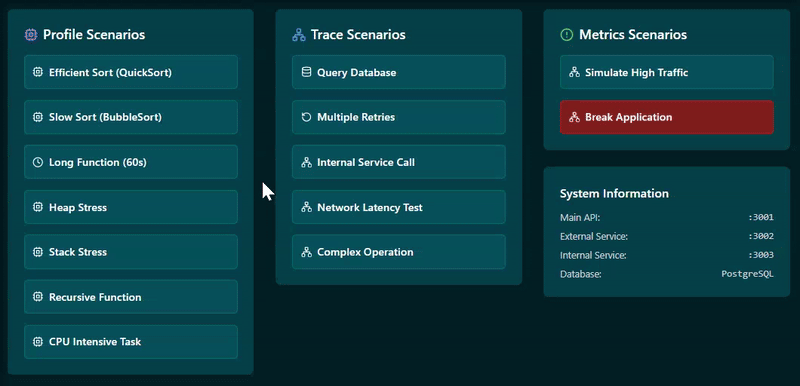
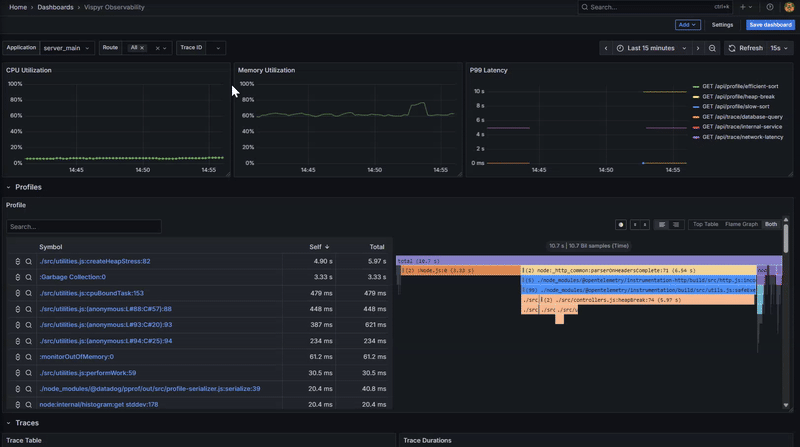
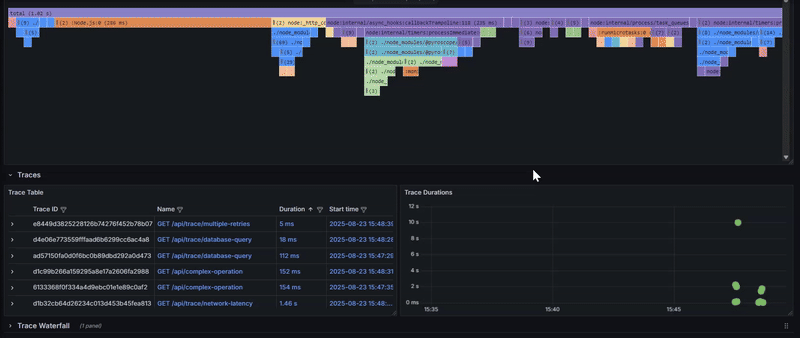

<div align="center">
  <a href="https://vispyr.com">
    
  </a>
</div>

# Vispyr Demo App

This Demo App was built to provide a quick and easy way for anyone to access Vispyr. When you run the app, you're able to simulate many scenarios that an actual application may encounter in production, and check how those can be observed through Vispyr.

# How to use

Clone this repository to your local environment and change directory:

```
git clone https://github.com/Vispyr/vispyr-demo-app.git && cd vispyr-demo-app
```

Make sure you have the Docker Daemon running on your system, then run the following command:

```
docker compose up -d
```
This will spin up the Demo App locally, along with [Vispyr's backend](https://github.com/Vispyr/vispyr-backend "Go to Vispyr backend") and the whole observability pipeline.

Access the app through port `5173` on your browser. It will provide you with 3 columns for testing scenarios: profiles, traces, and metrics. These are meant to serve Vispyr's dashboard with situations where each of these telemetry signals is more effective.

To access the Vispyr dashboard, go to `localhost:3000` on your browser. You'll be asked for credentials before accessing the dashboard. Use `admin` for both username and password, and a page will be opened where you can change your credentials. You can do so, or skip it. Next, Vispyr's dashboard will open and show visual representations of the telemetry data being sent by the Demo App.

# Demonstration

The Demo App contains buttons that you click to run scenarios to test. You can even break the application, which will stop all telemetry data coming from the app itself, but not the system metrics.

<div align="center">
  
</div>

Vispyr's dashboard allow you to zoom into the section of time you choose to focus on. If the system has a memory spike, for example, you can visually select that slice of the timeline:

<div align="center">
  
</div>

You can select a specific trace to understand why it took too long. The waterfall diagram opens with the details of the selected trace:

<div align="center">
  
</div>

# Learn more

Please refer to the [CLI documentation](https://github.com/Vispyr/vispyr-cli "Go to CLI page") for deployment instructions.

For a more detailed and comprehensive description of Vispyr, along with the motivation for its creation, please read our [case study](https://vispyr.com "Go to Case Study").
